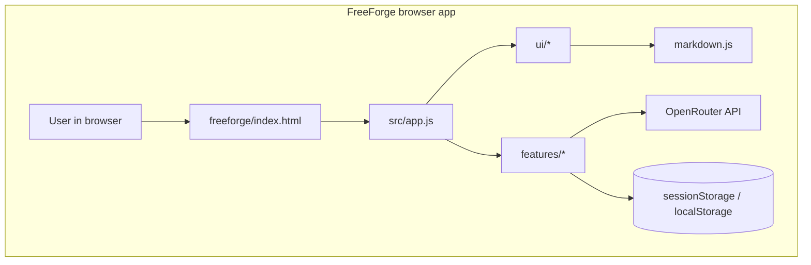

# FreeForge Chat

FreeForge Chat is a zero-build browser chat app for people who want to use OpenRouter free models without installing a local stack.

- Open the app directly in a modern browser and start chatting with an OpenRouter key.
- Keep the key in the current tab only; chat history and model choice stay in browser storage.

## Table of Contents

- [Quickstart](#quickstart)
- [Features](#features)
- [Architecture](#architecture)
- [Directory Structure](#directory-structure)
- [Usage](#usage)
- [Configuration](#configuration)
- [Commands](#commands)
- [Testing & Verification](#testing--verification)
- [Troubleshooting](#troubleshooting)
- [Stack Inventory](#stack-inventory)
- [Reproducibility & Maintenance](#reproducibility--maintenance)
- [Contributing](#contributing)
- [Governance](#governance)
- [Roadmap](#roadmap)
- [License](#license)

## Quickstart

### Prerequisites

- A modern browser with ES modules, Fetch, ReadableStream, and TextDecoder support. The app documents Chrome 97+, Firefox 104+, and Safari 15.4+ in `freeforge/index.html`.
- An OpenRouter API key.
- Node.js 22 if you want to run the repository checks used by CI.

### Install

No install step is required for the browser app. The runtime loads directly from `freeforge/index.html` and CDN-hosted libraries.

If you want to run the Node-based checks, no dependency install is needed first because the test suite uses built-in Node modules and `npx` fetches Biome on demand.

### Run

1. Open `freeforge/index.html` in your browser.
2. Paste your OpenRouter API key on the onboarding screen.
3. Select a free model and start chatting.

### Verify

```bash
npm --prefix freeforge test
npx --yes @biomejs/biome@1.9.4 check freeforge/src tests/security
```

## Features

- Browser-only chat UI for OpenRouter free models, with onboarding that validates keys against the OpenRouter models endpoint.
- Free-model selection that filters `:free` models and zero-priced models, then persists the chosen model in browser storage.
- Streaming chat completions with incremental rendering, stop generation support, and a context-usage pill.
- Markdown rendering for assistant responses with `marked` and DOMPurify sanitization before DOM insertion.
- Message actions for copy, regenerate, inline edit, undo of inline edits, and conversation export.
- Settings modal for updating or clearing the API key without leaving the app.
- Command palette for common actions and model switching.
- Static deployment with Netlify headers and a restrictive CSP.

## Architecture



- `src/app.js` owns startup, event wiring, and screen routing.
- `features/onboarding.js`, `features/models.js`, `features/chat.js`, `features/settings.js`, `features/palette.js`, and `features/export.js` handle the user workflows.
- `ui/messages.js`, `ui/screen.js`, `ui/ctx-pill.js`, and `ui/toast.js` handle rendering and feedback.
- `markdown.js` turns assistant text into sanitized HTML.

## Directory Structure

- `freeforge/index.html` - app shell, CDN imports, and browser entrypoint.
- `freeforge/src/` - browser modules for state, API calls, features, and UI helpers.
- `freeforge/styles/` - app CSS plus the checked-in Tailwind bundle.
- `tests/security/` - Node `node:test` coverage for runtime, UI, storage, and security behavior.
- `.github/workflows/` - CI for Node tests and Biome checks.
- `netlify.toml` - static publish target and security headers.

## Usage

### Common App Workflows

| Workflow | How |
|---|---|
| Start a new chat | Use `New Chat` in the app or the command palette. |
| Switch models | Use the model select in the nav bar or the command palette. |
| Edit a user message | Click a user bubble, edit inline, then save. |
| Undo an inline edit | Use the toast action that appears after saving the edit. |
| Export a conversation | Use the command palette action. |
| Clear local app state | Open Settings and use `Clear Key`, which also clears saved messages and model choice. |

### App Notes

- The key is validated with OpenRouter before the app switches into chat mode.
- Chat history is local to the browser.
- The context pill turns warning or danger as the conversation approaches the model limit.
- Clipboard actions depend on browser permissions and can be stricter on `file://` URLs.

## Configuration

No required environment variables. Runtime configuration lives in browser storage.

| Setting | Required | Default | Source | Description |
|---|---|---|---|---|
| `ff_key` | Yes to chat | None until saved | `freeforge/src/state.js`, `freeforge/src/features/onboarding.js`, `freeforge/src/features/settings.js` | OpenRouter API key stored in `sessionStorage` for the current tab. |
| `ff_msgs` | No | `[]` | `freeforge/src/features/chat.js` | Conversation history stored in `localStorage`. |
| `ff_model` | No | First free model returned by OpenRouter | `freeforge/src/features/models.js` | Selected model stored in `localStorage`. |

## Commands

| Command | Category | When to use | Source | Purpose |
|---|---|---|---|---|
| `npm --prefix freeforge test` | Test | Run the security-focused Node test suite. | `freeforge/package.json`, `.github/workflows/node-tests.yml` | Executes `node --test tests/security/*.test.mjs`. |
| `npx --yes @biomejs/biome@1.9.4 check freeforge/src tests/security` | Lint | Run the same Biome check used in CI. | `.github/workflows/biome-check.yml`, `biome.json` | Lints the browser runtime and security tests. |

## Testing & Verification

- `npm --prefix freeforge test` runs the repository's built-in Node test suite.
- `npx --yes @biomejs/biome@1.9.4 check freeforge/src tests/security` runs the same lint pass used in CI.
- CI also runs both checks on Node.js 22 via `.github/workflows/node-tests.yml` and `.github/workflows/biome-check.yml`.
- There is no build step in this repo.

## Troubleshooting

| Symptom | Likely cause | Exact fix |
|---|---|---|
| `Invalid API key` or the invalid-key banner appears | The OpenRouter key is wrong, expired, or revoked. | Open Settings and replace the key, then reconnect. |
| Model dropdown shows `No free models found` | The key is valid but has no free models available. | Use a different OpenRouter key or confirm the account can access free models. |
| Copy or clipboard actions fail on `file://` | The browser blocks clipboard access in that context. | Use a browser profile that allows clipboard access or serve the files over HTTP. |
| The context pill turns warning or danger | The conversation is approaching the model's context limit. | Start a new chat or export the current conversation first. |
| Requests return `Rate limited` | OpenRouter is throttling the account or IP. | Wait briefly and retry. |

## Stack Inventory

| Layer | Technology | Version | Source | Notes |
|---|---|---|---|---|
| Browser runtime | Modern browser | Chrome 97+, Firefox 104+, Safari 15.4+ | `freeforge/index.html` | Needs ES modules, Fetch, ReadableStream, and TextDecoder. |
| App shell | HTML5 | — | `freeforge/index.html` | Static entrypoint for the app. |
| Application code | Vanilla JavaScript ES modules | — | `freeforge/src/**/*.js` | No framework or bundler. |
| Styles | Tailwind CSS | 3 | `freeforge/package.json`, `freeforge/index.html` | Checked in as a local bundle. |
| Markdown parser | marked | 18.0.4 | `freeforge/package.json`, `freeforge/index.html` | Loaded from jsDelivr with SRI. |
| HTML sanitizer | DOMPurify | 3.4.8 | `freeforge/package.json`, `freeforge/index.html` | Loaded from jsDelivr with SRI. |
| Static hosting | Netlify | — | `netlify.toml` | Publishes `freeforge/` and sets security headers. |
| Test runner | Node.js `node:test` | 22 in CI | `.github/workflows/node-tests.yml`, `freeforge/package.json` | No test framework install required. |
| Linter | Biome | 1.9.4 | `.github/workflows/biome-check.yml`, `biome.json` | Lints `freeforge/src` and `tests/security`. |
| OpenRouter API | OpenRouter REST API | — | `freeforge/src/api.js` | Uses `/api/v1/models` and `/api/v1/chat/completions`. |

## Reproducibility & Maintenance

- Fresh clone verification: open `freeforge/index.html`, then run `npm --prefix freeforge test` and `npx --yes @biomejs/biome@1.9.4 check freeforge/src tests/security`.
- Updating CDN dependencies: change the script URLs and SRI hashes in `freeforge/index.html` and keep the metadata in `freeforge/package.json` aligned.
- Resetting local app state: clear `ff_key`, `ff_msgs`, and `ff_model`, or use Settings to clear the key and history.
- Local host note: the app can be opened directly from disk or served from any static host, but clipboard behavior may be stricter on `file://`.

## Contributing

See [CONTRIBUTING.md](CONTRIBUTING.md) for guidelines.

## Governance

| Area | Status | Source | Notes |
|---|---|---|---|
| Code of Conduct | [TBD] | [TBD] | No code-of-conduct file was found. |
| Security | Documented | `SECURITY.md` | Browser-side security posture and key storage notes. |
| License | Present | `LICENSE` | MIT License. |
| Maintainers | Present | `.github/CODEOWNERS` | GitHub CODEOWNERS file. |
| Support | [TBD] | [TBD] | No support policy file was found. |

## Roadmap

No public roadmap file was found in this repository. Use issues and `CHANGELOG.md` to track future work.

## License

MIT License. See [`LICENSE`](LICENSE).
