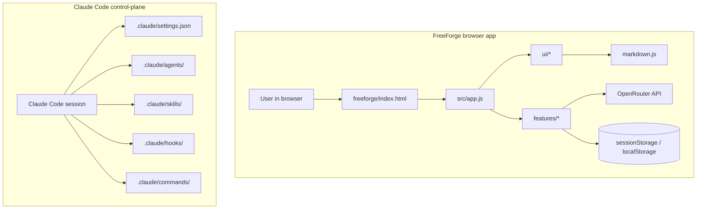

# FreeForge Chat

FreeForge Chat is a zero-build browser chat app for people who want to use OpenRouter free models without installing a local stack, and it includes Claude Code automation for safer maintenance of the repo.

- Open the app directly in a modern browser and start chatting with an OpenRouter key.
- Keep the key in the current tab only; chat history and model choice stay in browser storage.
- Use the Claude Code command, agent, skill, and hook layer in `.claude/` for controlled repo work.

## Table of Contents

- [Quickstart](#quickstart)
- [Features](#features)
- [Architecture](#architecture)
- [Directory Structure](#directory-structure)
- [Usage](#usage)
- [Configuration](#configuration)
- [Developer Command Center](#developer-command-center)
- [Testing & Verification](#testing--verification)
- [Troubleshooting](#troubleshooting)
- [Stack Inventory](#stack-inventory)
- [Reproducibility & Maintenance](#reproducibility--maintenance)
- [Contributing](#contributing)
- [Governance](#governance)
- [Roadmap](#roadmap)
- [License](#license)

## Quickstart

### Prerequisites

- A modern browser with ES modules, Fetch, ReadableStream, and TextDecoder support. The app documents Chrome 97+, Firefox 104+, and Safari 15.4+ in `freeforge/index.html`.
- An OpenRouter API key.
- Node.js 22 if you want to run the repository checks used by CI.

### Install

No install step is required for the browser app. The runtime loads directly from `freeforge/index.html` and CDN-hosted libraries.

If you want to run the Node-based checks, no dependency install is needed first because the test suite uses built-in Node modules and `npx` fetches Biome on demand.

### Run

1. Open `freeforge/index.html` in your browser.
2. Paste your OpenRouter API key on the onboarding screen.
3. Select a free model and start chatting.

### Verify

```bash
npm --prefix freeforge test
npx --yes @biomejs/biome@1.9.4 check freeforge/src tests/security
```

## Features

- Browser-only chat UI for OpenRouter free models, with onboarding that validates keys against the OpenRouter models endpoint.
- Free-model selection that filters `:free` models and zero-priced models, then persists the chosen model in browser storage.
- Streaming chat completions with incremental rendering, stop generation support, and a context-usage pill.
- Markdown rendering for assistant responses with `marked` and DOMPurify sanitization before DOM insertion.
- Message actions for copy, regenerate, inline edit, undo of inline edits, and conversation export.
- Settings modal for updating or clearing the API key without leaving the app.
- Command palette for common actions and model switching.
- Static deployment with Netlify headers and a restrictive CSP.
- Claude Code automation surface for handoff, quality gates, threat modeling, and control-plane checks.

## Architecture



- `src/app.js` owns startup, event wiring, and screen routing.
- `features/onboarding.js`, `features/models.js`, `features/chat.js`, `features/settings.js`, `features/palette.js`, and `features/export.js` handle the user workflows.
- `ui/messages.js`, `ui/screen.js`, `ui/ctx-pill.js`, and `ui/toast.js` handle rendering and feedback.
- `markdown.js` turns assistant text into sanitized HTML.
- `.claude/` contains the repo-maintenance layer used by Claude Code.

## Directory Structure

- `freeforge/index.html` - app shell, CDN imports, and browser entrypoint.
- `freeforge/src/` - browser modules for state, API calls, features, and UI helpers.
- `freeforge/styles/` - app CSS plus the checked-in Tailwind bundle.
- `tests/security/` - Node `node:test` coverage for runtime, UI, storage, and security behavior.
- `.claude/` - agent definitions, slash commands, workflows, hooks, settings, and skills.
- `.github/workflows/` - CI for Node tests and Biome checks.
- `netlify.toml` - static publish target and security headers.
- `managed-settings.example.json` - safe Claude settings template for managed environments.

## Usage

### Common App Workflows

| Workflow | How |
|---|---|
| Start a new chat | Use `New Chat` in the app or the command palette. |
| Switch models | Use the model select in the nav bar or the command palette. |
| Edit a user message | Click a user bubble, edit inline, then save. |
| Undo an inline edit | Use the toast action that appears after saving the edit. |
| Export a conversation | Use the command palette action. |
| Clear local app state | Open Settings and use `Clear Key`, which also clears saved messages and model choice. |

### App Notes

- The key is validated with OpenRouter before the app switches into chat mode.
- Chat history is local to the browser.
- The context pill turns warning or danger as the conversation approaches the model limit.
- Clipboard actions depend on browser permissions and can be stricter on `file://` URLs.

## Configuration

No required environment variables were discovered. The runtime configuration lives in browser storage and Claude settings files.

| Setting | Required | Default | Source | Description |
|---|---|---|---|---|
| `ff_key` | Yes to chat | None until saved | `freeforge/src/state.js`, `freeforge/src/features/onboarding.js`, `freeforge/src/features/settings.js` | OpenRouter API key stored in `sessionStorage` for the current tab. |
| `ff_msgs` | No | `[]` | `freeforge/src/features/chat.js` | Conversation history stored in `localStorage`. |
| `ff_model` | No | First free model returned by OpenRouter | `freeforge/src/features/models.js` | Selected model stored in `localStorage`. |
| Claude permissions | No | `auto` in `.claude/settings.json` | `.claude/settings.json`, `managed-settings.example.json`, `.claude/settings.local.example.json` | Agent permissions, hooks, and local override templates. |

## Developer Command Center

| Command | Category | When to use | Source | Purpose |
|---|---|---|---|---|
| `npm --prefix freeforge test` | Test | Run the security-focused Node test suite. | `freeforge/package.json`, `.github/workflows/node-tests.yml` | Executes `node --test tests/security/*.test.mjs`. |
| `npx --yes @biomejs/biome@1.9.4 check freeforge/src tests/security` | Lint | Run the same Biome check used in CI. | `.github/workflows/biome-check.yml`, `biome.json` | Lints the browser runtime and security tests. |
| `/swarm` | Claude command | Complex multi-file repo work. | `.claude/commands/swarm.md` | Starts the agentic coding swarm. |
| `/quality-gate` | Claude command | Before commit, merge, deploy, or release. | `.claude/commands/quality-gate.md` | Runs the full pre-commit validation path. |
| `/threat-model` | Claude command | Before auth, API, storage, or browser-security changes. | `.claude/commands/threat-model.md` | Produces a change threat model. |
| `/handoff` | Claude command | Before pausing multi-step work. | `.claude/commands/handoff.md` | Captures structured task state. |
| `/resume-handoff` | Claude command | When resuming paused work. | `.claude/commands/resume-handoff.md` | Loads saved handoff state. |
| `/runtime-smoke-check` | Claude command | After control-plane or runtime framework edits. | `.claude/commands/runtime-smoke-check.md` | Checks hooks, permissions, and fallback paths. |
| `/control-plane-check` | Claude command | After edits to `.claude/**`, `CLAUDE.md`, or `AGENTS.md`. | `.claude/commands/control-plane-check.md` | Verifies the Claude control plane structure. |
| `/issue-to-pr` | Claude command | Convert a task into PR-ready work. | `.claude/commands/issue-to-pr.md` | Packages implementation and verification into a PR path. |

### Agents

| Agent | Role | Scope | Source path |
|---|---|---|---|
| `codebase-cartographer` | Repo mapper | Read-only codebase exploration. | `.claude/agents/codebase-cartographer.md` |
| `implementation-engineer` | Bounded implementer | Edits in a constrained worktree. | `.claude/agents/implementation-engineer.md` |
| `docs-maintainer` | Docs updater | README and docs work. | `.claude/agents/docs-maintainer.md` |
| `security-reviewer` | Security reviewer | Threats, CSP, secrets, and browser risks. | `.claude/agents/security-reviewer.md` |
| `freeforge-browser-appsec` | Browser appsec specialist | XSS, DOM safety, and client-side risk. | `.claude/agents/freeforge-browser-appsec.md` |
| `openrouter-stream-engineer` | Streaming specialist | OpenRouter chat/stream flow. | `.claude/agents/openrouter-stream-engineer.md` |
| `zero-build-release-gate` | Release gate | Zero-build release readiness. | `.claude/agents/zero-build-release-gate.md` |
| `tdd-developer` | Test-first implementer | Bounded changes with tests. | `.claude/agents/tdd-developer.md` |

### Skills and Workflows

| Skill / workflow | When to invoke | What it checks | Source path |
|---|---|---|---|
| `orchestrating-swarm` | Complex multi-file work. | Delegation, reviewers, and final quality gates. | `.claude/skills/orchestrating-swarm/SKILL.md` |
| `running-quality-gate` | Pre-merge or pre-release validation. | Lint, typecheck, tests, security, dependency, and release readiness. | `.claude/skills/running-quality-gate/SKILL.md` |
| `threat-modeling-change` | Risky browser, auth, API, or storage change. | Pre-implementation threat modeling. | `.claude/skills/threat-modeling-change/SKILL.md` |
| `auditing-control-plane` | Any `.claude/**` or settings change. | Structural verification of the control plane. | `.claude/skills/auditing-control-plane/SKILL.md` |
| `recording-handoff-state` | Pausing multi-step work. | Structured handoff capture. | `.claude/skills/recording-handoff-state/SKILL.md` |
| `resuming-handoff-state` | Resuming paused work. | Restores saved task state. | `.claude/skills/resuming-handoff-state/SKILL.md` |
| `smoke-testing-runtime` | After control-plane edits. | Hook, permission, and runtime smoke checks. | `.claude/skills/smoke-testing-runtime/SKILL.md` |
| `healing-test-failures` | Failing test follow-up. | Minimal fix plus targeted rerun. | `.claude/skills/healing-test-failures/SKILL.md` |

### Hooks and Permissions

| Hook / permission | Event / scope | Purpose | Source path |
|---|---|---|---|
| `SessionStart` | Claude session start | Prints repo status and handoff context. | `.claude/hooks/workflow/session-start.js`, `.claude/settings.json` |
| `PreToolUse` `Bash` | Before shell commands | Blocks obviously dangerous commands and asks for approval on installs, deploys, and similar high-risk commands. | `.claude/hooks/validators/analyze-command.js`, `.claude/settings.json` |
| `PreToolUse` `Write|Edit|MultiEdit` | Before file writes | Protects `.env`, `.claude/**`, `CLAUDE.md`, `AGENTS.md`, and other sensitive paths. | `.claude/hooks/validators/protect-files.js`, `.claude/settings.json` |
| `PostToolUse` `Write|Edit|MultiEdit` | After file writes | Best-effort formatting of touched source files. | `.claude/hooks/workflow/format-touched-file.js`, `.claude/settings.json` |
| `Stop` and `StopFailure` | Session end | Emits a short reminder to run the quality gate and control-plane checks. | `.claude/hooks/workflow/stop-summary.js`, `.claude/settings.json` |
| Permission `deny` | Repo-wide | Blocks reads/writes of secrets, git internals, and forced or destructive commands. | `.claude/settings.json`, `managed-settings.example.json` |
| Permission `ask` | Repo-wide | Requires approval for control-plane edits, installs, deploys, migrations, and release-like operations. | `.claude/settings.json`, `managed-settings.example.json` |

## Testing & Verification

- `npm --prefix freeforge test` runs the repository's built-in Node test suite.
- `npx --yes @biomejs/biome@1.9.4 check freeforge/src tests/security` runs the same lint pass used in CI.
- CI also runs both checks on Node.js 22 via `.github/workflows/node-tests.yml` and `.github/workflows/biome-check.yml`.
- There is no build step in this repo.

## Troubleshooting

| Symptom | Likely cause | Exact fix |
|---|---|---|
| `Invalid API key` or the invalid-key banner appears | The OpenRouter key is wrong, expired, or revoked. | Open Settings and replace the key, then reconnect. |
| Model dropdown shows `No free models found` | The key is valid but has no free models available. | Use a different OpenRouter key or confirm the account can access free models. |
| Copy or clipboard actions fail on `file://` | The browser blocks clipboard access in that context. | Use a browser profile that allows clipboard access or serve the files over HTTP. |
| The context pill turns warning or danger | The conversation is approaching the model's context limit. | Start a new chat or export the current conversation first. |
| Requests return `Rate limited` | OpenRouter is throttling the account or IP. | Wait briefly and retry. |

## Stack Inventory

| Layer | Technology | Version | Source | Notes |
|---|---|---|---|---|
| Browser runtime | Modern browser | Chrome 97+, Firefox 104+, Safari 15.4+ | `freeforge/index.html` | Needs ES modules, Fetch, ReadableStream, and TextDecoder. |
| App shell | HTML5 | Unknown | `freeforge/index.html` | Static entrypoint for the app. |
| Application code | Vanilla JavaScript ES modules | Unknown | `freeforge/src/**/*.js` | No framework or bundler. |
| Styles | Tailwind CSS | 3 | `freeforge/package.json`, `freeforge/index.html` | Loaded from the CDN and checked in as a local bundle. |
| Markdown parser | marked | 18.0.4 | `freeforge/package.json`, `freeforge/index.html` | Loaded from jsDelivr with SRI. |
| HTML sanitizer | DOMPurify | 3.4.8 | `freeforge/package.json`, `freeforge/index.html` | Loaded from jsDelivr with SRI. |
| Static hosting | Netlify | Unknown | `netlify.toml` | Publishes `freeforge/` and sets security headers. |
| Test runner | Node.js `node:test` | 22 in CI | `.github/workflows/node-tests.yml`, `freeforge/package.json` | No test framework install required. |
| Linter | Biome | 1.9.4 | `.github/workflows/biome-check.yml`, `biome.json` | Lints `freeforge/src` and `tests/security`. |
| OpenRouter API | OpenRouter REST API | Unknown | `freeforge/src/api.js` | Uses `/api/v1/models` and `/api/v1/chat/completions`. |
| Claude control plane | Claude Code settings, agents, skills, hooks, commands | Unknown | `.claude/**`, `CLAUDE.md`, `AGENTS.md` | Repo-maintenance workflow and safety layer. |

## Reproducibility & Maintenance

- Fresh clone verification: open `freeforge/index.html`, then run `npm --prefix freeforge test` and `npx --yes @biomejs/biome@1.9.4 check freeforge/src tests/security`.
- Updating CDN dependencies: change the script URLs and SRI hashes in `freeforge/index.html` and keep the metadata in `freeforge/package.json` aligned.
- Resetting local app state: clear `ff_key`, `ff_msgs`, and `ff_model`, or use Settings to clear the key and history.
- Control-plane edits: if you change `.claude/**`, `CLAUDE.md`, or `AGENTS.md`, run `/control-plane-check` before treating the repo as ready.
- Local host note: the app can be opened directly from disk or served from any static host, but clipboard behavior may be stricter on `file://`.

## Contributing

Contribution guidelines are not yet formalized. Please open an issue before large changes.

Repo-maintenance rules live in `AGENTS.md` and `CLAUDE.md`.
See [`CONTRIBUTING.md`](CONTRIBUTING.md) for the repo-specific workflow, commands, and review expectations.

## Deployment

The repository is preconfigured for Netlify static hosting.

- Publish directory: `freeforge`
- Config file: `netlify.toml`
- Security headers: CSP, `X-Frame-Options`, `X-Content-Type-Options`, `Referrer-Policy`, `Permissions-Policy`, and HSTS

To deploy on Netlify:

1. Create a new site from this repository.
2. Leave the build command empty.
3. Set the publish directory to `freeforge` if Netlify does not detect it from `netlify.toml`.
4. Deploy the site.

You can also host the `freeforge/` directory on any static host that serves the HTML, CSS, and JavaScript files directly.

## Governance

| Area | Status | Source | Notes |
|---|---|---|---|
| Code of Conduct | [TBD] | [TBD] | No code-of-conduct file was found. |
| Security | Documented | `SECURITY.md` | Browser-side security posture and key storage notes. |
| License | Present | `LICENSE` | MIT License. |
| Maintainers | [TBD] | [TBD] | No maintainer file was found. |
| Support | [TBD] | [TBD] | No support policy file was found. |

## Roadmap

No public roadmap file was found in this repository. Use issues, `CHANGELOG.md`, and the existing Claude workflow files to track future work.

## License

MIT License. See [`LICENSE`](LICENSE).
